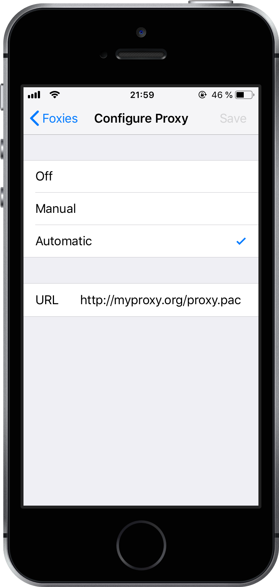

# Configure SOCKS Proxy on iOS with PAC

Sometimes you might need to access certain websites via proxy, for example when
they are blocked in your country. In the same time, you can avoid passing all
requests through a proxy server and only pass those that are blocked.

For example, some ISPs block the [telegram.org](https://telegram.org) website.
To be able to access it, you need to configure your operating system to use
proxy for all the requests to the hosts in the `telegram.org` domain and use
direct connection for all the other requests.

## Serve a PAC File

This can be easily done with a [Proxy Auto-Configuration (PAC)
file](https://developer.mozilla.org/en-US/docs/Web/HTTP/Proxy_servers_and_tunneling/Proxy_Auto-Configuration_(PAC)_file).
Simply create a PAC file and host it on a web-server.

Here is an example of a PAC file:

<<< @/proxy-and-vpn/files/proxy.pac

And here is an example of a virtual server configuration in Nginx:

<<< @/proxy-and-vpn/files/nginx-proxy-pac.conf

## Configure SOCKS proxy on iOS

1. Open **Settings > Wi-Fi > _Your network name_**.

2. Scroll down to the **HTTP PROXY** section and tap **Configure Proxy**.

    

      
    

    ::: tip
    Although the section is named _HTTP PROXY_, iOS supports SOCKS as
    well.
    :::

3. Tap **Configure Proxy**, then select **Automatic**.

4. In the **URL** field, type the URL of the `proxy.pac` file.

    

      
    

## References

- Proxy Auto-Configuration (PAC) file - HTTP | MDN

    <https://developer.mozilla.org/en-US/docs/Web/HTTP/Proxy_servers_and_tunneling/Proxy_Auto-Configuration_(PAC)_file>

- Change in iOS 10.2 and Greater Proxy pac Files [David's Public Pages]

    <https://blog.remyservices.net/technology/blog/2017_2_20>

 
<ClientOnly>
<Disqus shortname="notes-maxie-xyz" />
</ClientOnly>

 

    Allow loading scripts from disqus.com to see the comments.

