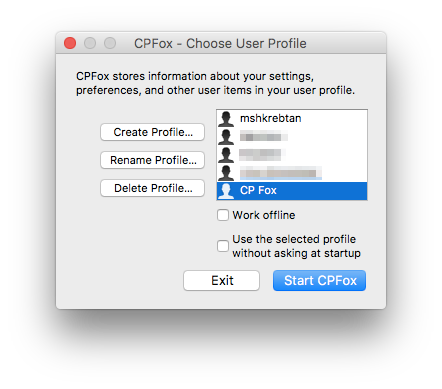
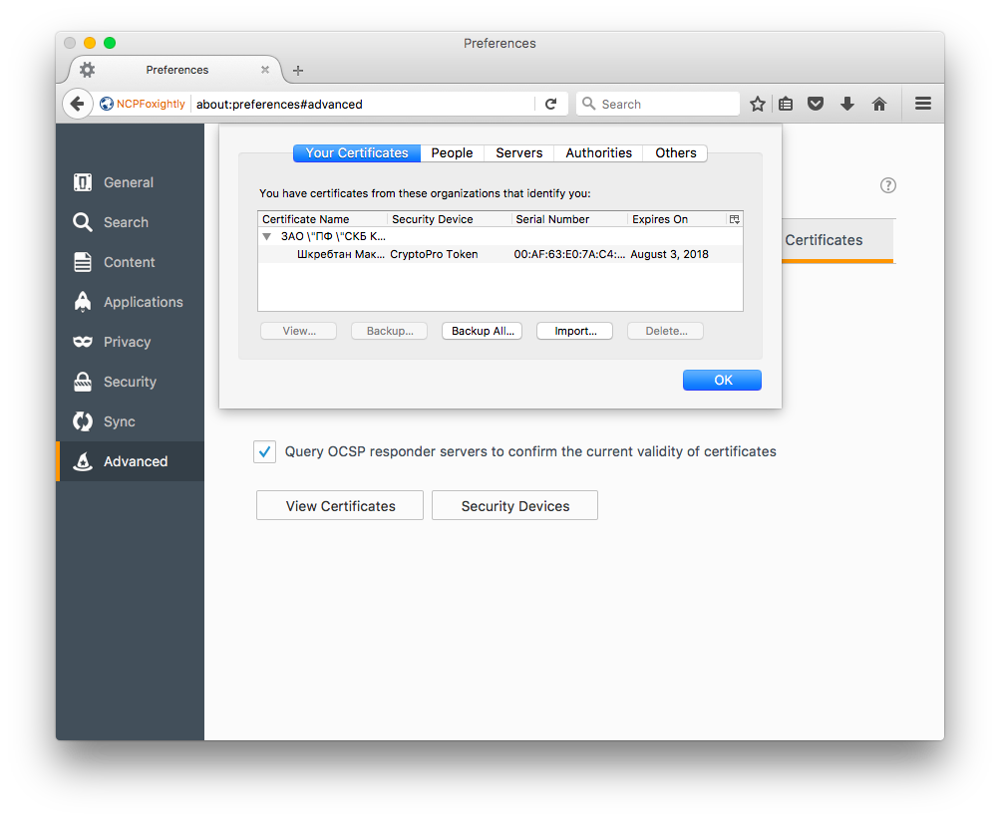

# Использование электронной подписи на сайте nalog.ru

_Данная статья описывает использование электронной подписи с квалифицированным
сертификатом, записанной на защищённый носитель Рутокен, и СКЗИ КриптоПро CSP
на операционной системе macOS Sierra (10.12)._

::: warning
Данная статья была написана мной в августе 2017 года. С тех пор актуальность
информации в статье могла быть утрачена.
:::

## Получение квалифицированной электронной подписи

_Генерацией ключей шифрования квалифицированных электронных подписей (КЭП) и
выпуском квалифицированных сертификатов открытых ключей занимаются
удостоверяющие центры._

Уведомление с сайта nalog.ru:

> Для авторизации в сервисе необходим квалифицированный сертификат ключа
> проверки электронной подписи (КСКПЭП), выданный Удостоверяющим центром,
> аккредитованным Минкомсвязи России, который может храниться на любом
> носителе: жёстком диске, USB-ключе или смарт-карте.

> Для корректной авторизации в сервисе рекомендуем использовать
> квалифицированный сертификат ключа проверки электронной подписи
> (КСКПЭП),соответствующий положениям Федерального закона от 06.04.2011 N63-ФЗ.

Для изготовления своей квалифицированной подписи я обратился в удостоверяющий
центр [СКБ Контур](https://kontur.ru/ca/price/fiz). В результате я получил
квалифицированную ЭП вместе с квалифицированным сертификатом, записанные на
защищённый носитель Рутокен Lite, а также лицензию на право использования СКЗИ
КриптоПро CSP сроком действия 1 год.

## Установка СКЗИ КриптоПро CSP

Загрузить сертифицированные версии СКЗИ КриптоПро CSP можно отсюда: [КриптоПро
CSP - Загрузка файлов](https://www.cryptopro.ru/products/csp/downloads).
Однако, необходимо предварительно зарегистрироваться на сайте cryptopro.ru.

Необходимо загрузить и установить пакет **«КриптоПро CSP для Apple OS X (со
встроенным КриптоПро Fox с поддержкой TLS на ГОСТ)»**.

КриптоПро Fox представляет собой веб-браузер на основе Mozilla Firefox ESR,
поддерживающий установку защищённых соединений (Transport Layer Security, TLS)
с использованием российских криптографических алгоритмов. Браузер с поддержкой
шифрования защищённых соединений по ГОСТ 34.10-2001, 28147-89 — это одно из
требований сервиса nalog.ru; подробнее о требованиях можно прочитать здесь:
[nalog-ru-digital-signature](https://lkip.nalog.ru/certificate/requirements).

## Установка сертификата в систему

_На примере с моим Рутокеном._

- Подключаем защищённый носитель к Макинтошу;

- запускаем Terminal (`/Applications/Terminal.app`) и переходим в
директорию КриптоПро CSP:

    ```
    $ cd /opt/cprocsp/bin
    ```

- выводим список подключённых защищённых носителей:

    ```
    $ ./csptest -card -enum
    Aktiv Rutoken lite
    Total: SYS: 0.000 sec USR: 0.000 sec UTC: 0.030 sec
    ```

- видим, что на данный момент подключён один носитель с именем `Aktiv Rutoken
lite`.

- выводим список всех контейнеров на всех носителях:

    ```
    $ ./csptest -keyset \
        -enum_containers \
        -verifycontext \
        -fqcn \
        -unique
    CSP (Type:80) v4.0.9014 KC1 Release Ver:4.0.9842 OS:MacOS CPU:AMD64 FastCode:READY:AVX.
    AcquireContext: OK. HCRYPTPROV: 4314903251
    \\.\Aktiv Rutoken lite\12441848@2017-08-03-???????? ?????? ?????????|\\.\Aktiv Rutoken lite\SCARD\rutoken_lt_36ec64d1\0A00\1C71
    OK.
    Total: SYS: 0.060 sec USR: 0.490 sec UTC: 0.870 sec
    [ErrorCode: 0x00000000]
    ```

    Опция `-fqcn` используется для вывода полного имени контейнера в
    формате `<имя носителя>\<имя контейнера>`.

    Опция `-unique` используется для вывода уникального имени контейнера,
    которое отображается сразу после вертикальной черты (`|`). Оно
    понадобится для выполнения следующей команды.

- установим сертификат из контейнера `SCARD\rutoken_lt_36ec64d1\0A00\1C71`
(имя вашего контейнера, конечно, будет отличаться):

    ```
    $ ./csptestf -absorb -certs \
        -pattern 'SCARD\rutoken_lt_36ec64d1\0A00\1C71'
    Match: SCARD\rutoken_lt_36ec64d1\0A00\1C71
    OK.
    Total: SYS: 0.170 sec USR: 1.470 sec UTC: 2.450 sec
    [ErrorCode: 0x00000000]
    ```

- выведем список установленных сертификатов:

    ```
    $ ./certmgr -list
    Certmgr 1.0 (c) "CryptoPro",  2007-2010.
    program for managing certificates, CRLs and stores

    =============================================================================
    1-------
    Issuer              : E=ca@skbkontur.ru, OGRN=XXXXXXXXXXXXX, INN=XXXXXXXXXXXX, C=RU, S=66 Свердловская область, L=Екатеринбург, STREET=Пр. Космонавтов д. 56, OU=Удостоверяющий центр, O="ЗАО ""ПФ ""СКБ Контур""", CN="УЦ ЗАО ""ПФ ""СКБ Контур"""
    Subject             : INN=XXXXXXXXXXXX, E=XXXXXXXXXX@gmail.com, C=RU, S=78 г. Санкт-Петербург, L=Санкт-Петербург, CN=Шкребтан Максим, SN=Шкребтан, G=Максим, SNILS=XXXXXXXXXXX
    ...
    SHA1 Hash           : 0x85f75ab194300ee8493c3c0cb48dd374e6505da6
    Signature Algorithm : ГОСТ Р 34.11/34.10-2001
    PublicKey Algorithm : ГОСТ Р 34.10-2001 (512 bits)
    Not valid before    : 02/08/2017  21:44:01 UTC
    Not valid after     : 02/08/2018  21:54:01 UTC
    PrivateKey Link     : Yes
    Container           : SCARD\rutoken_lt_36ec64d1\0A00\1C71
    Provider Name       : Crypto-Pro GOST R 34.10-2012 KC1 CSP
    Provider Info       : ProvType: 80, KeySpec: 1, Flags: 0x0
    ...
    =============================================================================

    [ErrorCode: 0x00000000]
    ```


## Настройка и использование CP Fox

::: danger
Если вы используете Firefox в качестве основного веб-браузера, то
я настоятельно рекомендую создать **отдельный профиль** для CP Fox и **не
использовать** ваш основной профиль в CP Fox. Это позволит сохранить ваш
основной профиль **в целости**. Проверено на себе.
:::

### Создание нового профиля для CP Fox

Для создания профиля необходимо запустить Firefox Profile Manager; подробную
инструкцию можно прочитать в статье на сайте [Mozilla
Support](https://support.mozilla.org/en-US/kb/profile-manager-create-and-remove-firefox-profiles).

Если коротко, то:

- запускаем Terminal (`/Applications/Terminal.app`);

- из терминала запускаем CP Fox с опцией `--ProfileManager`:

    ```
    /Applications/cpfox.app/Contents/MacOS/cpfox --ProfileManager
    ```



- в появившемся окне нажимаем _Create Profile_, _Continue_, вводим имя нового
профиля, нажимаем _Done_;

- если вы используете Firefox в качестве основного браузера, **обязательно
снимаем галочку** _Use the selected profile without asking at startup_. Мы
ни в коем случае не хотим, чтобы CP Fox вдруг запустился с нашим основным
профилем Firefox.

- запускаем CP Fox с новым профилем.

### Проверка сертификатов

Для начала необходимо убедиться, что в CP Fox установлено расширение
*CPROCadesPlugin*. Для этого достаточно перейти на страницу `about:addons` и
проверить, что расширение есть в списке. Если же расширение не установлено, то
следует загрузить его и установить: [КриптоПро ЭЦП Browser
plug-in](https://www.cryptopro.ru/products/cades/plugin/).

После того, как вы установите ваш сертификат в систему с помощью `csptestf`, он
должен отобразиться в CP Fox. Необходимо перейти в настройки браузера, в раздел
Advanced (`about:preferences#advanced`), на вкладку _Certificates_ и нажать
_View Certificates_. В окне с сертификатами, на вкладке _Your Certificates_, вы
должны увидеть свой сертификат.



### Установка необходимых сертификатов

Для работы с сервисом nalog.ru необходимо установить несколько сертификатов
удостоверяющих центров Минкомсвязи России. Их можно скачать со специального
портала Госуслуг: [Портал УФО: Головной
УЦ](http://e-trust.gosuslugi.ru/MainCA).

Отпечатки необходимых сертификатов:

- `8B983B891851E8EF9C0278B8EAC8D420B255C95D`
- `9E78A331020E528C046FFD57704A21B7D2241CB3`
- `538AD264547716302401CDFB316B287DB12BA675`
- `1AF6FCE68CE3F822C6FAD4CB32AD58FF59FBC221`
- `B11108FFDCAD99D7A845023AB552CB1ABE845A1B`
- `9D05A704C8C1E565ACDE5878FE0BB96EC53C2A40`
- `0408435EB90E5C8796A160E69E4BFAC453435D1D`
- `0932E483C4420E668F64D360006D0BEB0BFACCA7`

Данные сертификаты необходимо устанавливать в хранилище root, так они являются
сертификатами головных (root) удостоверяющих центров.

Установка ключей также производится с помощью утилиты `certmgr`; в
качестве значения параметра `-f` указывается файл ключа. Например:

```
/opt/cprocsp/bin/certmgr -inst \
  -store uroot \
  -f 8B983B891851E8EF9C0278B8EAC8D420B255C95D.cer
```

После установки сертификатов, перезапустите CP Fox, и убедитесь, что эти
сертификаты видны в списке _Authorities_.


## Вход в личный кабинет на nalog.ru

При входе в личный кабинет индивидуального предпринимателя
(<https://lkipgost.nalog.ru/lk>) появится предупреждение _Your connection is
not secure_, так как браузеру ничего не известно об удостоверяющем центре АО
«ГНИВЦ». Необходимо добавить сертификат в список доверенных, то есть в
исключения.

Теперь при входе в личный кабинет сайт потребует от вас идентифицировать себя с
помощью сертификата. Выбираете нужный и нажимаете _OK_. Не забывайте, что при
этом защищённый носитель должен ключей и сертификатов быть подключён к
компьютеру.


<br/>
<ClientOnly>
<Disqus shortname="notes-maxie-xyz" language="ru"/>
</ClientOnly>

<br/>
<div style="text-align: center; font-size: x-small">
    Разрешите загрузку JavaScript с домена disqus.com, чтобы увидеть комментарии.
</div>
